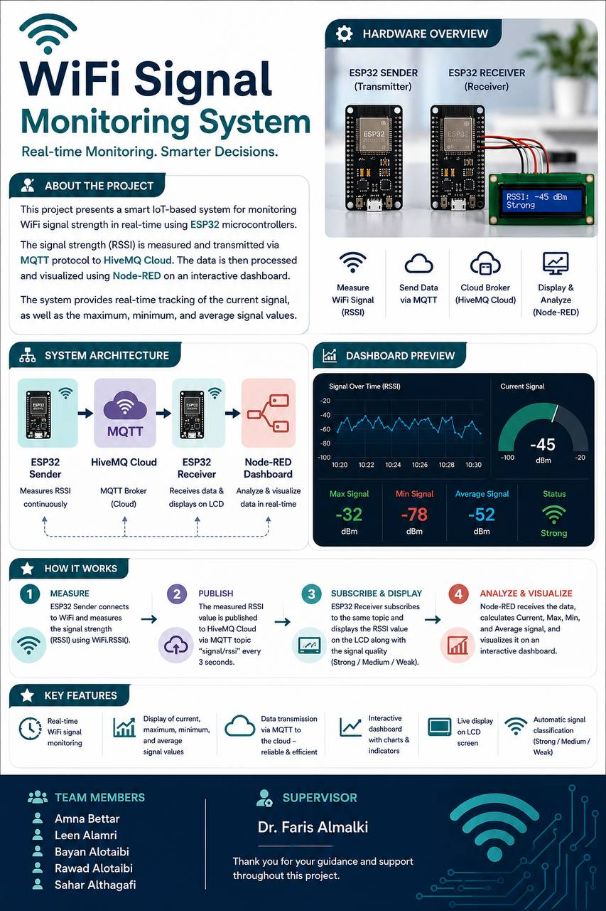
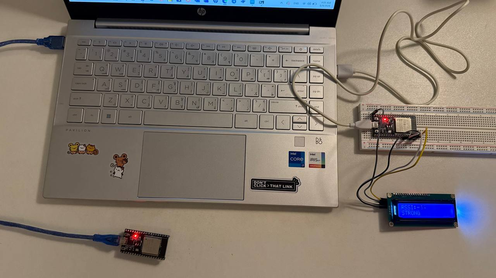
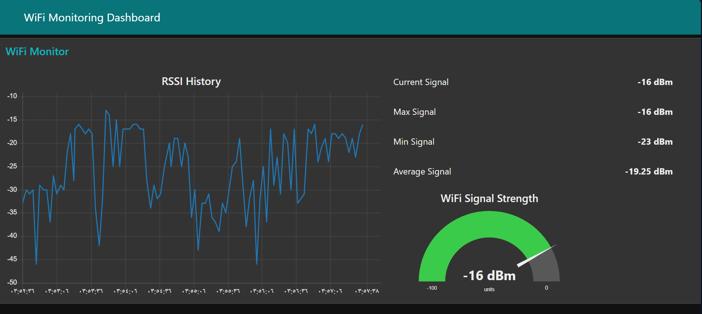

# WiFi Signal Monitoring System

An IoT-based WiFi Signal Monitoring System developed using ESP32 microcontrollers to measure WiFi signal strength (RSSI) in real time. The system transmits data via MQTT to HiveMQ Cloud, visualizes it using Node-RED, and displays live signal information on an LCD screen.

---

## Project Overview

This project aims to monitor WiFi signal strength continuously and provide real-time visualization of network quality. The system consists of two ESP32 boards communicating through MQTT, allowing users to observe current, maximum, minimum, and average RSSI values through an interactive dashboard.

---

## Features

- Real-time WiFi signal strength (RSSI) monitoring
- MQTT communication using HiveMQ Cloud
- Interactive Node-RED dashboard
- LCD display for live RSSI values
- Signal quality classification (Strong / Medium / Weak)
- Packet Tracer network simulation
- Historical RSSI visualization
- Maximum, minimum, and average signal calculation

---

## Technologies Used

- ESP32
- Arduino IDE
- C++
- MQTT
- HiveMQ Cloud
- Node-RED
- LCD 16x2 (I2C)
- Cisco Packet Tracer

---

## Repository Structure
ESP32-Code/
│── ESP_sender.ino
│── ESP32_receiver.ino

Images/
│── Poster.jpg
│── Hardware.jpg
│── Dashboard.jpg

Node-RED/
│── flows.json

PacketTracer/
│── project_CN.pkt

Report.pdf
README.md

---

## System Architecture

The system consists of:

1. ESP32 Sender measures WiFi RSSI.
2. RSSI data is published to HiveMQ Cloud using MQTT.
3. ESP32 Receiver subscribes to the MQTT topic.
4. Node-RED processes and visualizes the received data.
5. LCD displays the live signal strength.

---

## Project Images

### Project Poster

### Hardware Setup

### Dashboard

---

## Report

The complete project documentation can be found in:

Report.pdf

---

## Supervisor

Dr. Faris Almalki

---

## Team Members

- Amna Bettar
- Leen Alamri
- Bayan Alotaibi
- Rawad Alotaibi
- Sahar Althagafi

---

## Acknowledgment

This project was developed as a team project for the Computer Engineering program at Taif University.

Special thanks to Dr. Faris Almalki for his guidance and support throughout the project.

---

## License

This project is shared for educational purposes.
